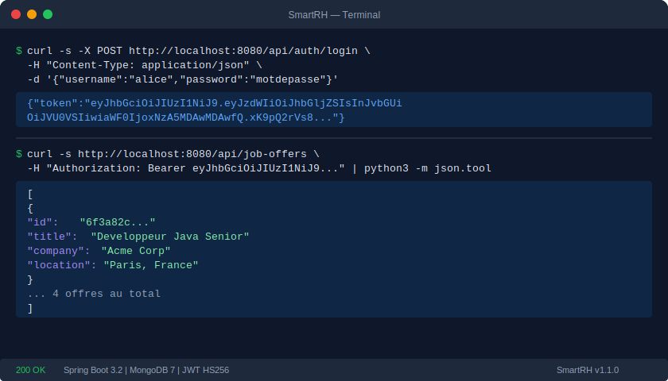
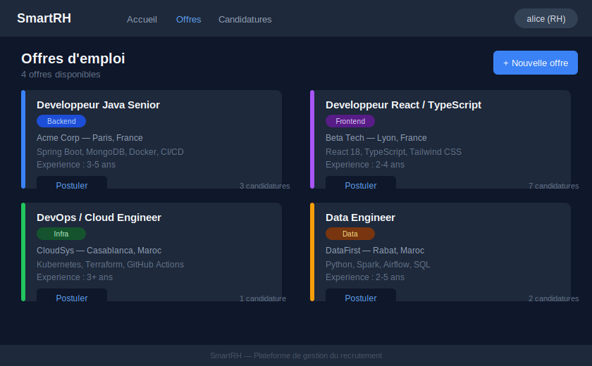
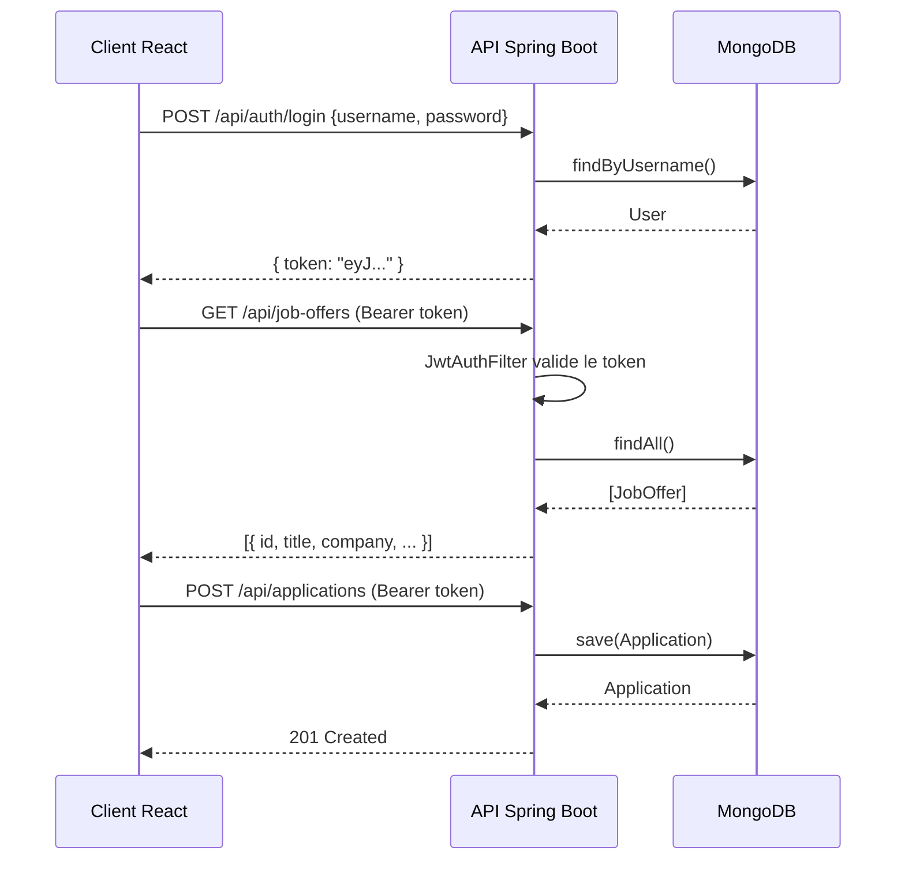

<div align="center">

# SmartRH

Plateforme de gestion du recrutement — offres d'emploi, candidatures et authentification JWT.

[](https://github.com/Anasoufkir/smartrh/actions/workflows/ci.yml)
[](https://openjdk.org/projects/jdk/17/)
[](https://spring.io/projects/spring-boot)
[](https://react.dev/)
[](https://www.mongodb.com/)
[](./docker-compose.yml)
[](./LICENSE)

[Demo](#demo) · [Installation](#installation-rapide) · [API](#api-reference) · [Tests](#tests)

</div>

---

## Pourquoi ce projet

| Probleme | Solution apportee par SmartRH |
|---|---|
| Les offres d'emploi sont dispersees sur plusieurs outils | Interface centralisee pour creer et consulter toutes les offres |
| Suivi des candidatures difficile sans outil dedie | Chaque candidature est liee a une offre, consultable par les RH |
| Acces non securise aux donnees sensibles | Authentification JWT stateless avec validation de chaque requete |
| Mise en place lente sur un nouveau poste | Une commande Docker Compose demarre l'ensemble de la stack |

---

## Demo

### Terminal — API en action



### Tableau de bord — Liste des offres



---

## Comment ca marche



---

## Installation rapide

**Prerequis :** Docker et Docker Compose installes.

```bash
git clone https://github.com/Anasoufkir/smartrh.git
cd smartrh
cp .env.example .env
docker compose up --build
```

L'application est disponible sur :
- Frontend : http://localhost:3000
- Backend API : http://localhost:8080/api

---

## Installation en developpement

Voir [SETUP.md](SETUP.md) pour le guide complet.

```bash
# Backend
cd Back && mvn spring-boot:run

# Frontend (dans un second terminal)
cd front && npm install && npm start
```

Prerequis : Java 17, Maven 3.9, Node 20, MongoDB 7 en local.

---

## API Reference

### Authentification

| Methode | Endpoint | Description |
|---------|----------|-------------|
| POST | `/api/auth/signup` | Creer un compte |
| POST | `/api/auth/login` | Obtenir un token JWT |

**Login — exemple :**

```bash
curl -X POST http://localhost:8080/api/auth/login \
  -H "Content-Type: application/json" \
  -d '{"username":"alice","password":"motdepasse"}'

# Reponse
{"token":"eyJhbGciOiJIUzI1NiJ9..."}
```

### Offres d'emploi

| Methode | Endpoint | Auth | Description |
|---------|----------|------|-------------|
| GET | `/api/job-offers` | Non | Lister toutes les offres |
| GET | `/api/job-offers/{id}` | Non | Detail d'une offre |
| POST | `/api/job-offers` | Oui | Creer une offre |
| PUT | `/api/job-offers/{id}` | Oui | Modifier une offre |
| DELETE | `/api/job-offers/{id}` | Oui | Supprimer une offre |

**Creer une offre :**

```bash
curl -X POST http://localhost:8080/api/job-offers \
  -H "Authorization: Bearer <token>" \
  -H "Content-Type: application/json" \
  -d '{"title":"Developpeur Java","company":"Acme","location":"Paris","description":"..."}'
```

### Candidatures

| Methode | Endpoint | Auth | Description |
|---------|----------|------|-------------|
| GET | `/api/applications` | Oui | Lister toutes les candidatures |
| POST | `/api/applications` | Oui | Soumettre une candidature |
| PUT | `/api/applications/{id}` | Oui | Modifier une candidature |
| DELETE | `/api/applications/{id}` | Oui | Supprimer une candidature |

**Soumettre une candidature :**

```bash
curl -X POST http://localhost:8080/api/applications \
  -H "Authorization: Bearer <token>" \
  -H "Content-Type: application/json" \
  -d '{"applicantName":"Alice","applicantEmail":"alice@example.com","cvLink":"https://...","jobId":"<id>"}'
```

---

## Tests

```bash
# Tests backend (unitaires, Mockito)
cd Back && mvn test

# Tests frontend
cd front && npm test -- --watchAll=false

# Tests avec rapport de couverture
cd front && npm test -- --watchAll=false --coverage
```

Le pipeline CI execute automatiquement tous les tests a chaque push.

---

## Deploiement

### Docker Compose (recommande)

```bash
cp .env.example .env
# Editer .env avec les vraies valeurs de production
docker compose up -d
```

### Demarrage manuel avec PM2

```bash
# Backend
cd Back
mvn package -DskipTests
pm2 start "java -jar target/smartrhV1-0.0.1-SNAPSHOT.jar" --name smartrh-api

# Frontend
cd front
npm run build
pm2 serve build 3000 --name smartrh-ui
```

Voir [SETUP.md](SETUP.md) pour les details de configuration en production.

---

## Architecture

```
smartrh/
├── Back/               Spring Boot 3.2 — API REST + JWT
│   └── src/
│       ├── controller/ Endpoints HTTP
│       ├── services/   Logique metier
│       ├── repository/ Acces MongoDB
│       ├── model/      Entites de donnees
│       ├── security/   JwtUtil + JwtAuthFilter
│       └── exception/  Gestionnaire d'erreurs global
└── front/              React 18 — SPA
    └── src/
        ├── components/ Composants UI
        └── services/   Couche Axios
```

Voir [ARCHITECTURE.md](ARCHITECTURE.md) pour les details.

---

## Contribuer

Les contributions sont les bienvenues. Consulter [CONTRIBUTING.md](CONTRIBUTING.md) pour le guide.

---

<div align="center">

Developpe par [Anasoufkir](https://github.com/Anasoufkir)

</div>
